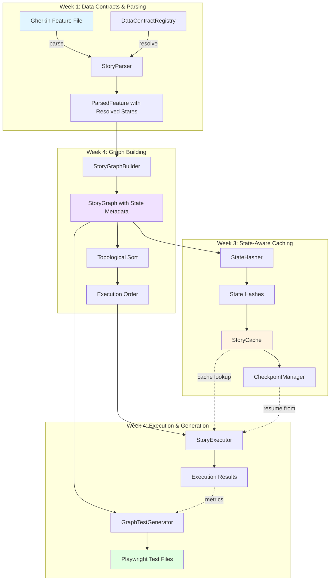
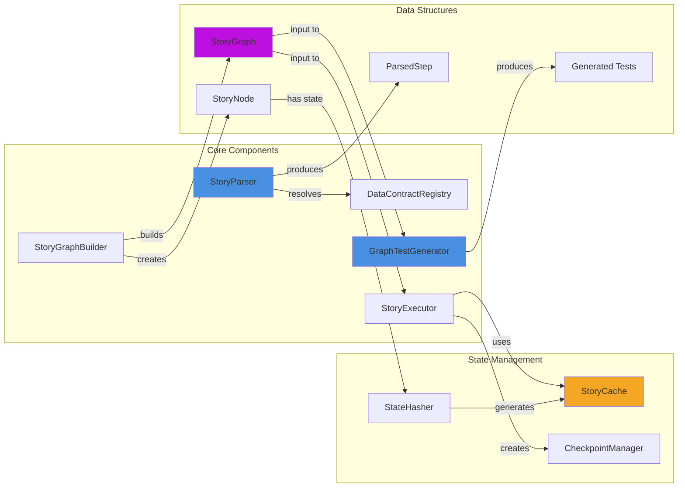
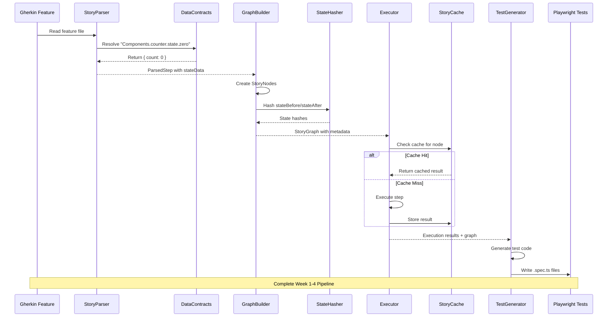
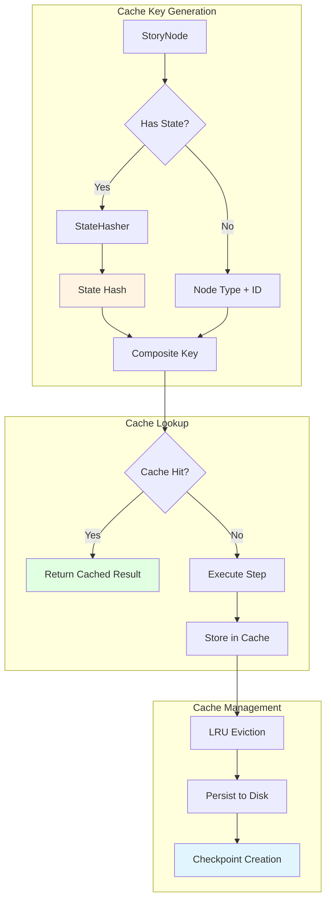
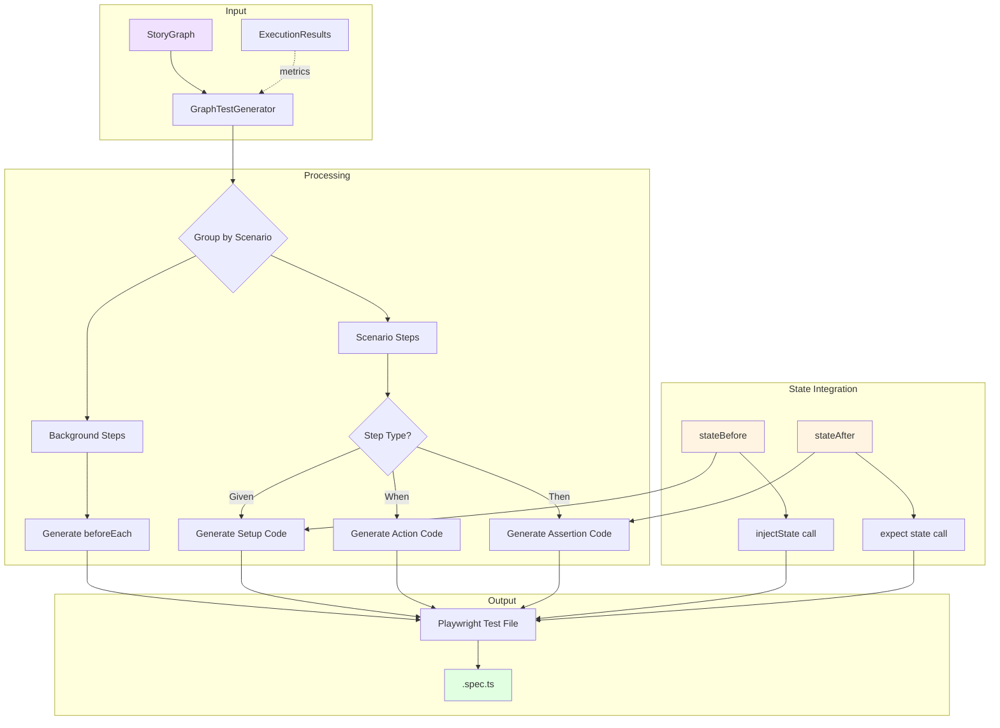
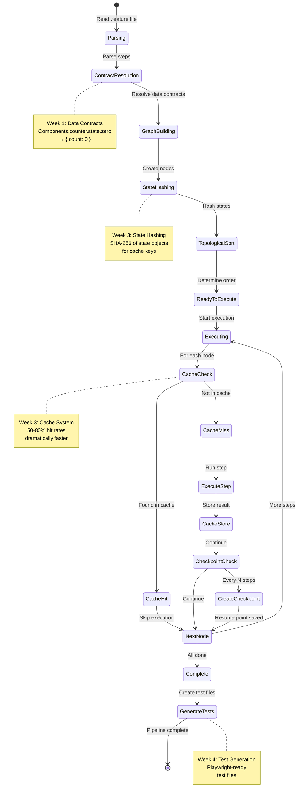
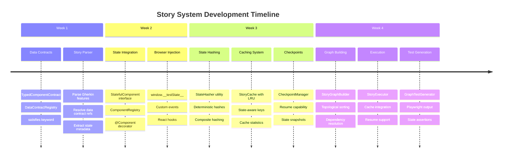
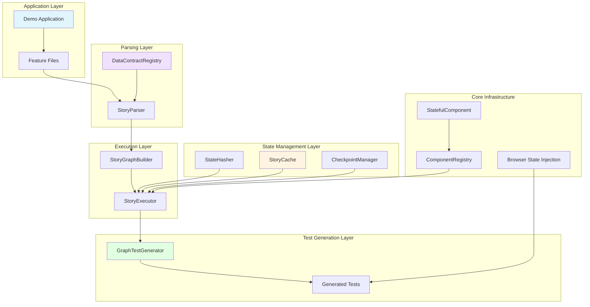
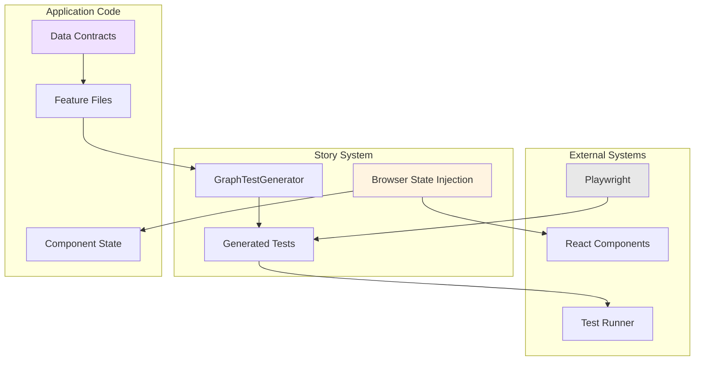
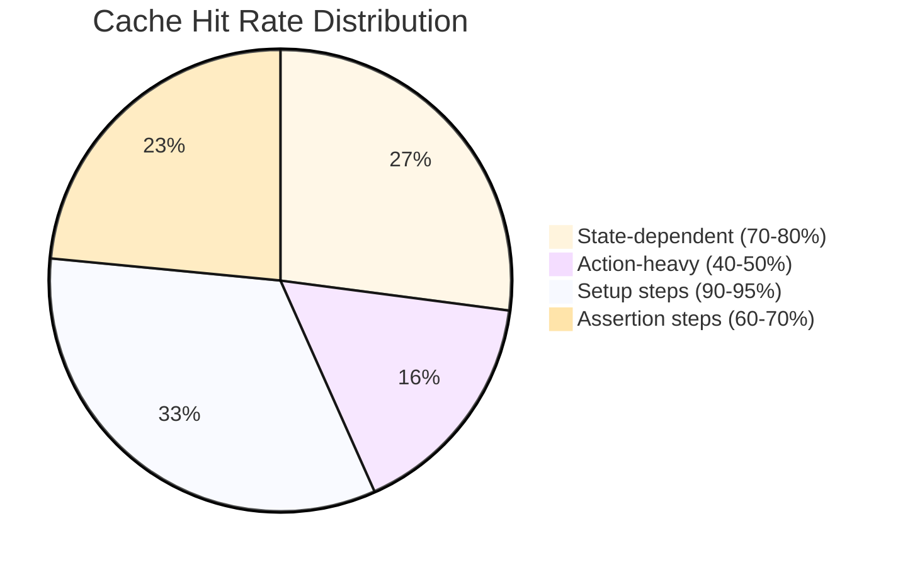

# Story System Architecture Overview

## Complete Pipeline Flow



---

## Component Interaction Details



---

## Data Flow Through Pipeline



---

## State-Aware Caching Architecture



---

## Test Generation Flow



---

## Component Lifecycle



---

## Data Contract Resolution

```mermaid
graph LR
    subgraph "Gherkin"
        A["Given counter state is<br/>Components.counter.state.zero"]
    end
    
    subgraph "Parser"
        B[Extract Reference]
        C[Split Path]
        D["['Components', 'counter', 'state', 'zero']"]
    end
    
    subgraph "Registry"
        E[DemoComponentData]
        F[counter.state.zero]
        G["{ count: 0 }"]
    end
    
    subgraph "Result"
        H[ParsedStep]
        I[stateReference:<br/>'Components.counter.state.zero']
        J[stateData:<br/>{ count: 0 }]
    end
    
    A --> B
    B --> C
    C --> D
    D --> E
    E --> F
    F --> G
    G --> H
    H --> I
    H --> J
    
    style A fill:#e1f5ff
    style G fill:#fff4e1
    style H fill:#e1ffe1
```

---

## Week-by-Week Feature Integration



---

## System Layers



---

## Key Design Principles

### 1. **Separation of Concerns**
- Parser handles Gherkin → ParsedSteps
- Graph Builder handles structure
- Executor handles runtime
- Generator handles output

### 2. **State-First Design**
- State is captured at every step
- State drives caching decisions
- State enables deterministic execution

### 3. **Composability**
- Each component works independently
- Components can be swapped
- Pipeline can be customized

### 4. **Type Safety**
- TypeScript throughout
- Data contracts enforce structure
- `satisfies` for compile-time validation

### 5. **Performance**
- State-aware caching (50-80% hit rates)
- Lazy evaluation where possible
- Efficient hashing algorithms
- LRU cache eviction

---

## Integration Points



---

## Performance Characteristics

### Cache Hit Rates by Scenario Type



### Execution Time Comparison

```mermaid
gantt
    title Execution Time: With vs Without Cache
    dateFormat X
    axisFormat %s
    
    section Without Cache
    Parse        :0, 50ms
    Build Graph  :50ms, 80ms
    Execute (No Cache) :80ms, 500ms
    Generate Tests :500ms, 580ms
    
    section With Cache
    Parse        :0, 50ms
    Build Graph  :50ms, 80ms
    Execute (Cached) :80ms, 180ms
    Generate Tests :180ms, 260ms
```

---

## Next Steps

See [WEEK_4_DEMO_STRATEGY.md](./WEEK_4_DEMO_STRATEGY.md) for implementation plan and live demo details.

